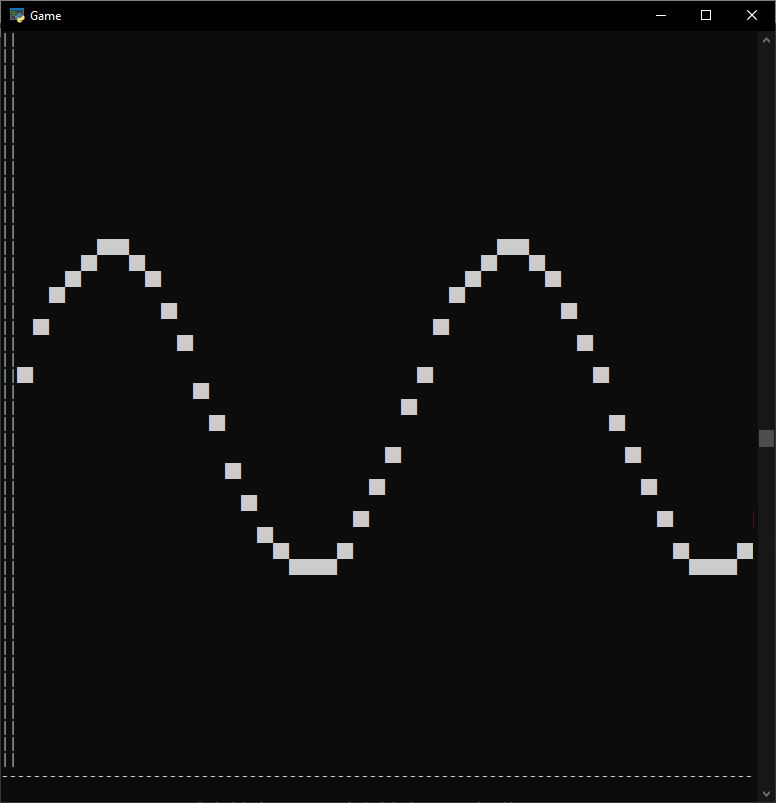
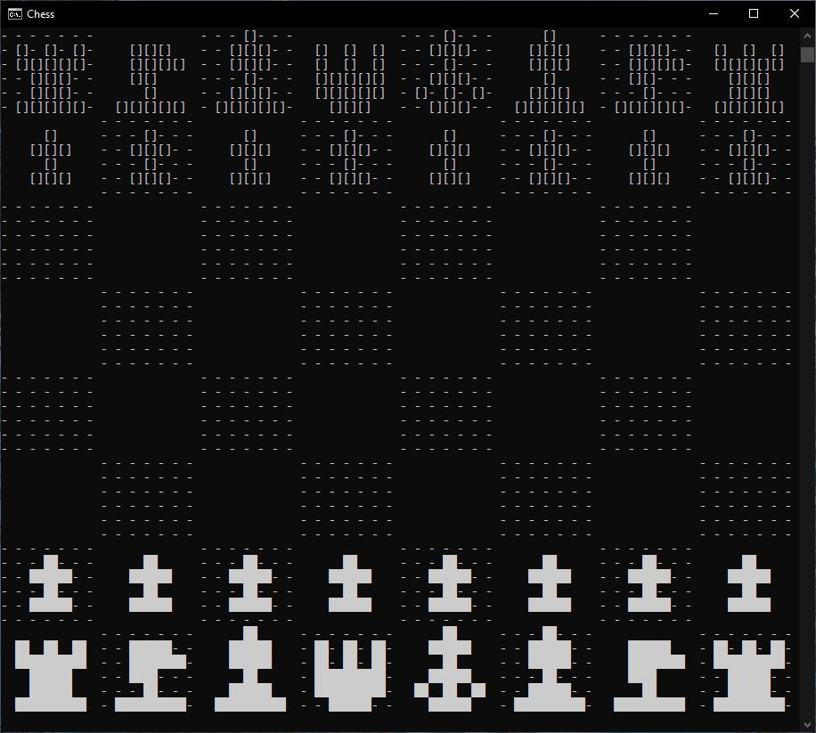

<html>
<body>

  

    <h1> Navigation </h1>
    

      <a href="https://github.com/SciCapt"> Homepage </a>
       
      <a href="https://github.com/SciCapt/Projects"> Projects Page </a>
    

  

  
  

  <h1>Chess In Python</h1>
  

    This project technically started in April of 2022, but used a GUI based on the MatLab plotting for python. There were multiple reasons for why that was a nightmare to work with, so I instead opted to make my own GUI more or less from scratch.
      
    Luckily around the same time, I had played around with using the Windows command prompt to display a black and white screen based on a certain array/image given to it. An example of this is given below where the GUI takes a mathematical expression and then graphs it in the first quadrant:
     
    
      
    By then making the sprites of the chess board and pieces using this same array definition idea, I could instead stich them onto a larger array and print the whole thing:
     
    
     
  

  

