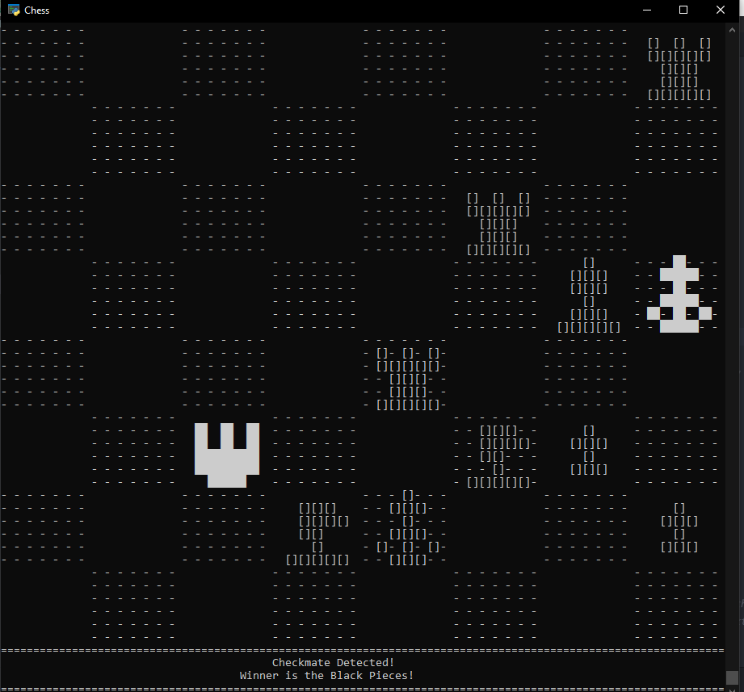

<html>
<body>

  

    <h1> Navigation: </h1>
    

      <a href="https://scicapt.github.io"> Homepage </a>
       
      <a href="https://scicapt.github.io/Projects"> Projects Page </a>
       
      <a href="https://scicapt.github.io/Resume">Resume Page</a>
    

  

  
  

  <h1>Chess In Python</h1>
    <h2><a href="https://github.com/SciCapt/Chess_Completed">Link to my Chess GitHub page</a></h2>
  

    This project technically started in April of 2022, but used a GUI based on the MatLab plotting for python. There were multiple reasons for why that was a nightmare to work with, so I instead opted to make my own GUI more or less from scratch.
      
    Luckily around the same time, I had played around with using the Windows command prompt to display a black and white screen based on a certain array/image given to it. An example of this is given below where the GUI takes a mathematical expression and then graphs it in the first quadrant:
     
    
      
    By then making the sprites of the chess board and pieces using this same array definition idea, I could instead stich them onto a larger array and print the whole thing:
     
    
      
    There's a lot of work that then went into the code to actually allow for generating the legal moves given a board position, how to allow the player to move pieces, correctly checking for checkmates, etc. The most interesting part was figuring out how to allow using the mouse for selecting pieces to move. Weeding out all of the possible bugs required *lots* of game play testing over time. It was probably May of 2022 by the time I was happy with how it was. But with that done, it was time to make some AIs to play against.
      
    The first AI, "Bob", was a good test, and just selected a random move from all its legal moves. Over time, I put more thought into each AI, and kept finding better ways to make the next one. One of my recent designs works rather well for having only a few simple rules, and was the first AI to be able to actually find checkmates well:
     
    
      
    This better form of AI is #'s 6-9 in the chess code on my GitHub. Each finds some small way to work better, with of course #9 working the best. Until I better optimize the code, they do take some time to calculate each move. Originally they took ~30 seconds at the start of the game but got down to ~1-2 seconds about 10-15 moves into the game. With some recent optimizations, I was able to bring those numbers down by about half, with hopefully even better results soon!
      
    As of Feburary 2023, I've still managed to make more AIs, all with unique play styles. I've granted most of them the ability to check for mate-in-ones and take them if they're available. They've managed to catch me off guard a few times now! My biggest area of 'research' at the moment is using my Monte Carlo neural nets as an AI form. I've tried a few small size nets (~10e4 parameters) to get down a good method of training, and now plan to make a much larger, more capable one. 
     
    Check out my neural net project <a href="https://github.com/SciCapt/Monte-Carlo-Neural-Nets">here!</a>
      
    It would be silly to try to summarize everything the GitHub page talks about, so if you've made it this far, please feel free to check out my summary of updates in the <a href="https://github.com/SciCapt/Chess_Completed/releases">Releases</a> section. I've made some more recent additions (such as said speed optimzations, a new AI design, etc.) that are yet to be updated on the page, but once it's all organized it will be updated. The neural net project has certainly been taking the majority of my time, so hopefully I'll get more of that updated and uploaded to GitHub soon.
    
  

  

