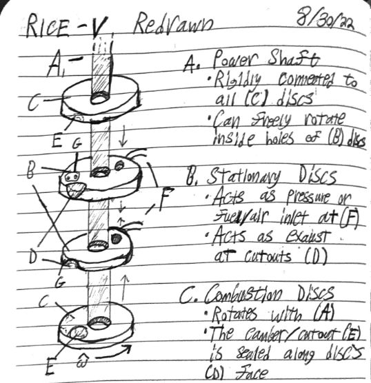
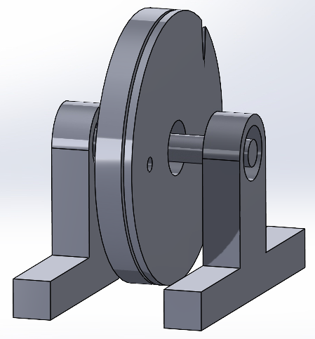
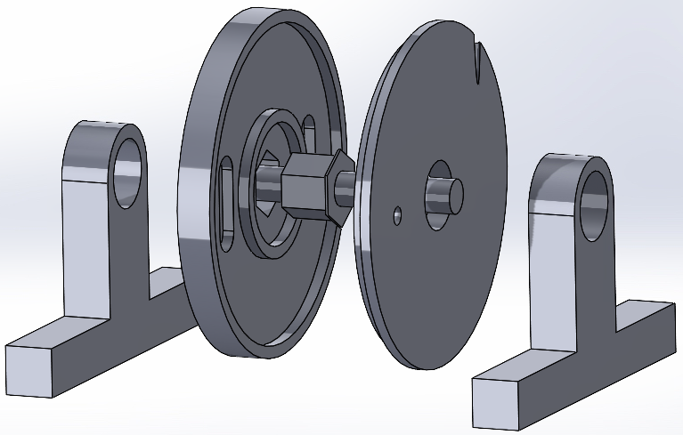
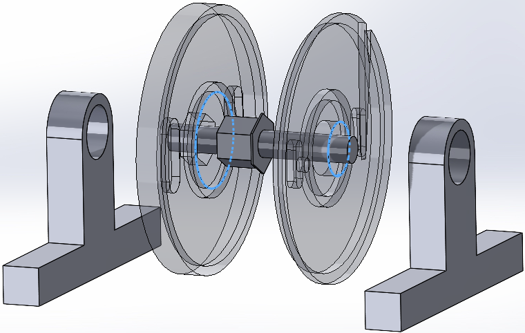
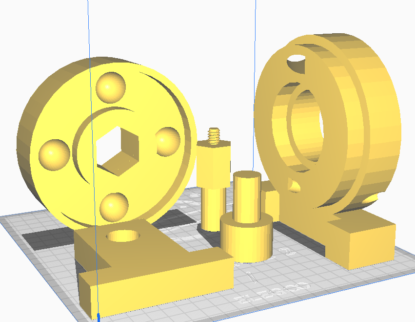

<html>
<body>

  

    <h1> Navigation </h1>
    

      <a href="https://scicapt.github.io"> Homepage </a>
       
      <a href="https://scicapt.github.io/Projects"> Projects Page </a>
       
      <a href="https://scicapt.github.io/Resume">Resume Page</a>
    

  

  
  

  <h1>Disc/Rotary Engine</h1>
  

    This concept started in one of my many journals where I write down fun ideas I have. This is actually the fifth iteration of a more radial-based engine design I've tried. Here's a page from that notebook where I was drafting the idea:
      
    
     
    There were a few pages where I sketched ideas and tried to figure out the general operation of the engine, and attempted to do some torque calculations for various types of fuel. Not sure how much of that was correct looking back on it.
    I then realized the only reasonable way I could test this design (besides the math) was to make a 3D model and print it. So for this, I learned the basics behind parts and assemblies in SolidWorks (which I was able to use thanks to my school's free cloud app/library usage) and put together the following basic design:
      
    
    <!--    -->
    
             
    This was an okay starting place, but it was still quite clearly a general idea, nothing I could actually make and expect to work. I spent a bit more time on SolidWorks, and figuring out what would be reasonable and possible to put together and got to the following design:
      
    
     
    
     
    
     
    I was quite happy with this design, but actually putting this together took quite some time, as I only had access to SolidWorks through my school's cloud software program. I was certainly grateful for having that, but SoildWorks was rather lethargic to use over the internet in this way, so I moved to TinkerCad and just remade the whole thing pretty quickly in a day:
      
    
     
    While some small details like the screw portion I wanted to use to connect the two ends of the shaft together didn't quite work out, the overall design did fit together quite nicely. Note how the sides were either pushed down or further out from the disks, this helped to make a better 'sleeve' to keep the air inside between the disks. I ended up making a 3D print of this design and it worked great! I used a air can in the first test just to check that it was properly spinning and such, and it sounded like a true engine spinning up much more than I anticipated!
  

  

