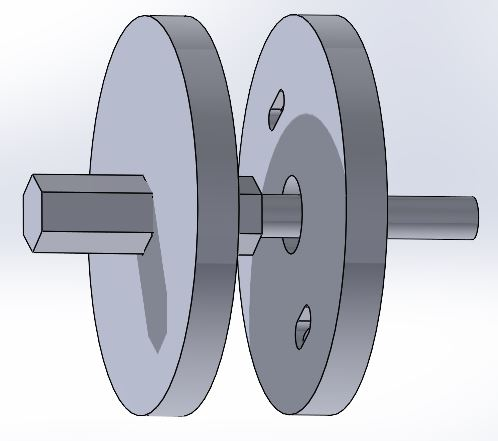
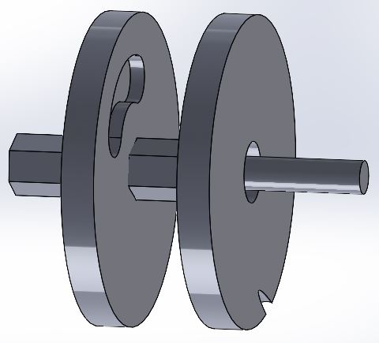

<html>
<body>

  

    <h1> Navigation </h1>
    

      <a href="https://scicapt.github.io"> Homepage </a>
       
      <a href="https://scicapt.github.io/Projects"> Projects Page </a>
    

  

  
  

  <h1>Disc/Rotary Engine</h1>
  

    This concept started in one of my many journals where I write down various ideas I have. This is actually the fifth iteration of a more radial-based engine design I've tried. Here's the original picture from my notebook:
      
    
      
    I then realized the only reasonable way I could test this design (besides the math discussed later) was to make a 3D model and print it. So for this, I learned the basics behind parts and assemblies in SolidWorks and put together the following basic design:
      
    Viewing it from the left slightly:
     
    
     
    Viewing it from the right slightly:
     
    
     
  

  

