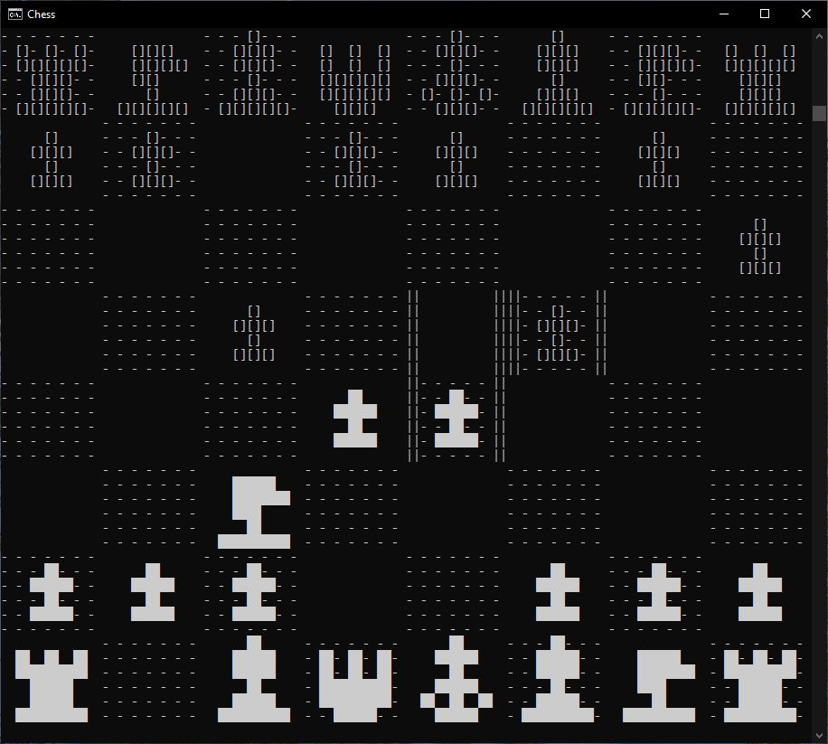
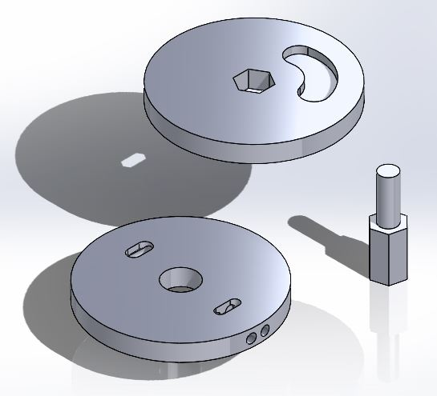

<html>
<body>

  <h2>
    <a href="https://scicapt.github.io/"> Back To Homepage </a>
  </h2>
  
  

    <h1>Hobby Projects</h1>
    

      Below are some of the various hobby projects I've worked on over time, in no specific order. If you want to see more about a specific project, just click on the image to go to the page for that project.
        
    

    
    <h1>Chess and Chess AIs in Python</h1>
    

      
      A fully custom-made chess engine featuring a few chess Ais of different capabilities.
    

    
      
    
    <h1>Custom "Rotary" Engine Design</h1>
    

       
      
      Oh yeah and im a god at 3d modeling (not really)
    

</body>
</html>
