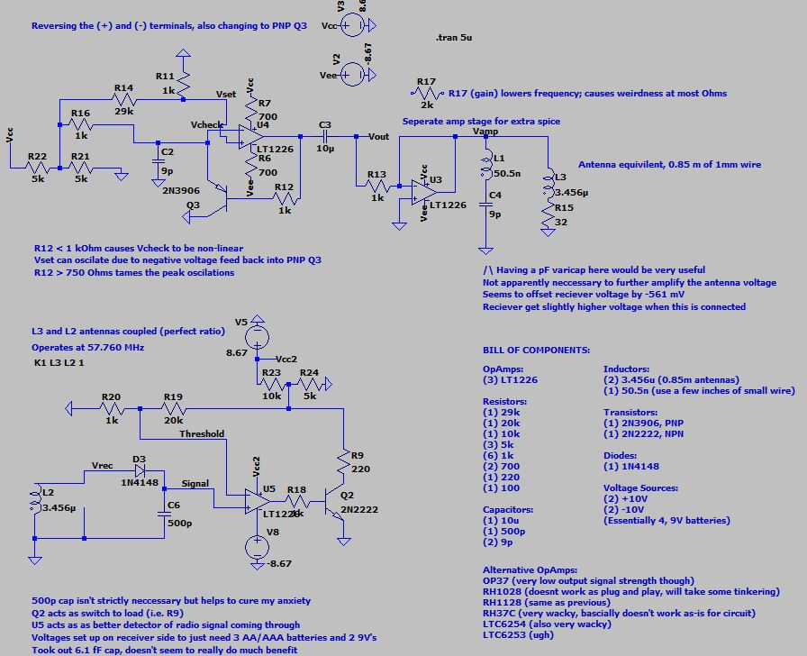

<html>
<body>

  

    <h1> Navigation </h1>
    

      <a href="https://scicapt.github.io"> Homepage </a>
       
      <a href="https://scicapt.github.io/Resume">Resume Page</a>
    

  

  
  

    <h1>Hobby Projects</h1>
    

      Below are some of the various hobby projects I've worked on over time, in no specific order. If you want to see more about a specific project, just click on the image or title to go to the page for that project.
        
    

    
    <a href="https://scicapt.github.io/Chess"> <h1>Chess and Chess AIs in Python</h1> </a>
    

      
      Chess
    

    
         
    
    <a href="https://scicapt.github.io/DiscEngine"> <h1>Custom Disc Engine Design</h1> </a>
    

      
      Engine
    

    
            
    
    <a href="https://scicapt.github.io/Radio"> <h1>Custom Radio Circuit</h1> </a>
    

      
      Radio
    

