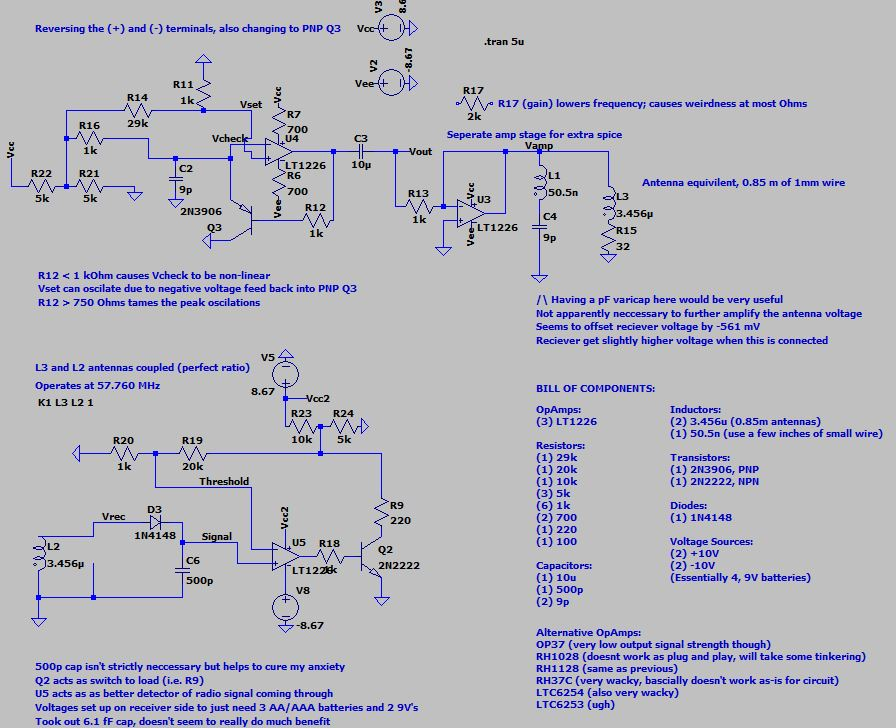

<html>
<body>

<h1> Navigation: </h1>

<a href="https://scicapt.github.io"> Homepage </a>
 
<a href="https://scicapt.github.io/Projects"> Projects Page </a>
 
<a href="https://scicapt.github.io/Resume">Resume Page</a>

<h1>Radio Transmitter and Reciever</h1>

  This project represents the one personal project I've had that was done for a grade at my university (UF). Completed as the final project for one of the last courses in the UF Physics sequence (and done in place of a custom high-voltage supply idea that did not get approved for some reason) I had a few main goals for this project. Specifically:
  <ul>
    <li>See just how fast of an oscillator I could make with my skills at the time</li>
    <li>Test my current knowledge of antennas and radio waves</li>
    <li>Simply see if I had the ability to make my own radio, purely from my own knowledge</li>
  </ul>
  All of which I believe I completed to a high degree. For example, I was able to produce an oscillator that was too fast for the measurement equipment available in the class's lab and was also too fast for any through-hole operational amplifier (OpAmp) component I could find. It was also fast enough that my professor questioned why I would try to do such a thing, which was a big success in my eyes.
    
  By then slowing down the oscillator, I then constructed the rest of the circuitry needed for outputting enough power to an antenna to transmit across a large-ish (very technical, I know) sized room. Along with this, I made a basic receiver that had a filter to check for the correct frequency transmission, and when it was detected, would power some other system (or just a light as a simple demonstration).
    
  My hope is that in a few years I will be able to look back on my design and find all the ways it could be improved. I am most certainly proud of it, but I'm confident there are many better ways to do the various tasks of each subcircuit. If curious, here was the design I built (along with my various notes and component list):
   
    
    

</body>
</html>
